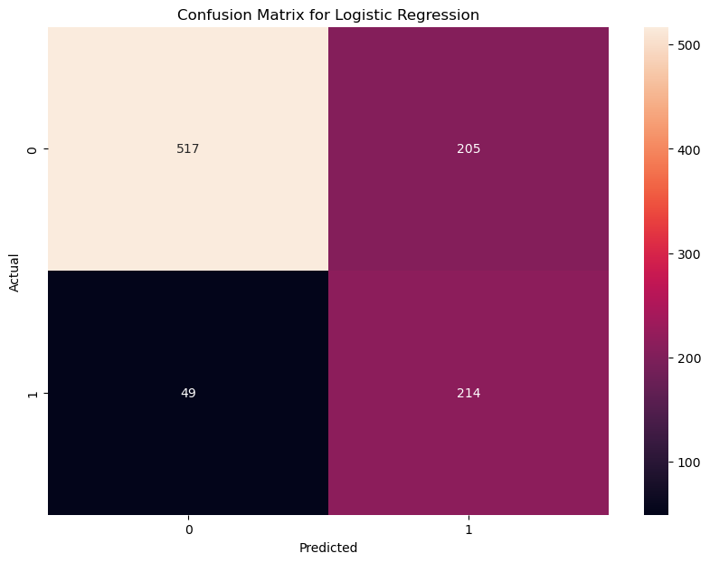
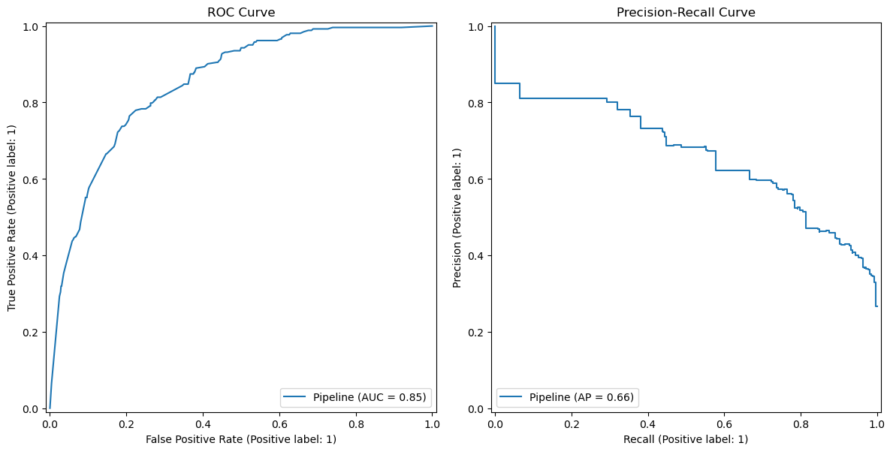
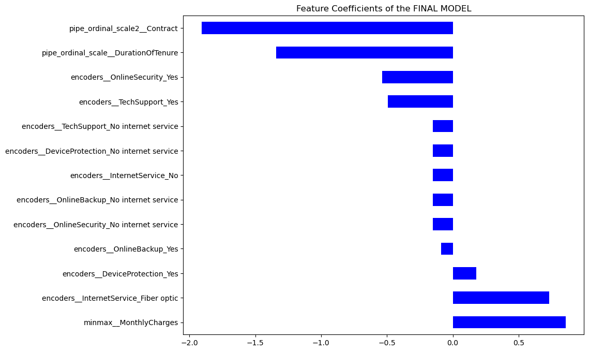
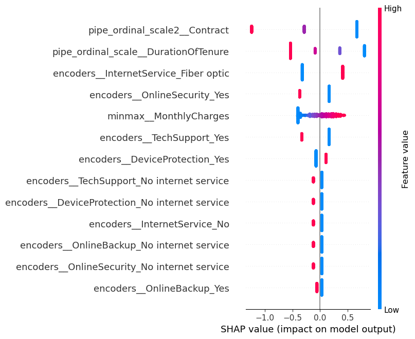
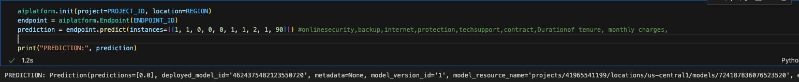
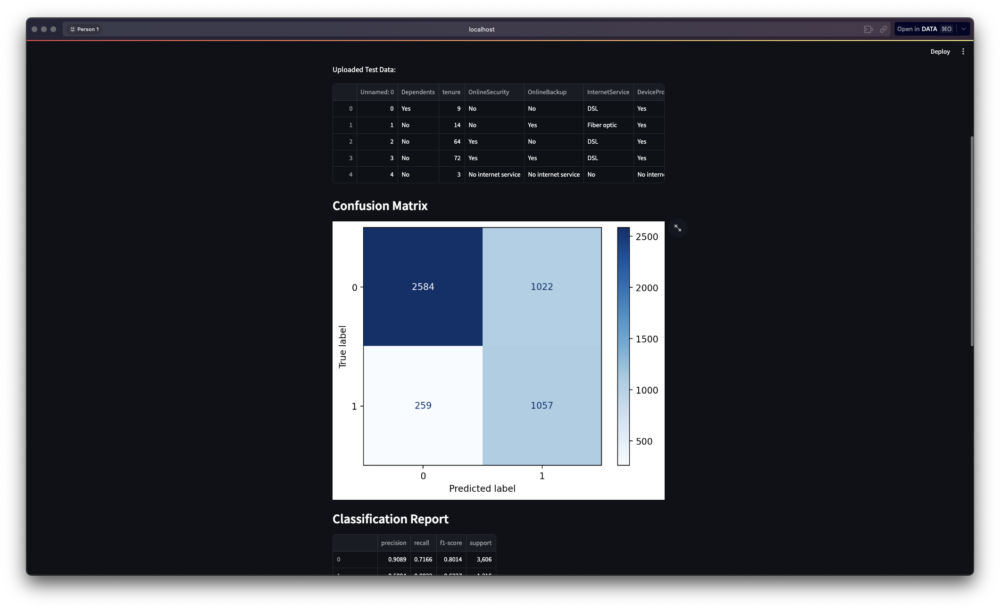
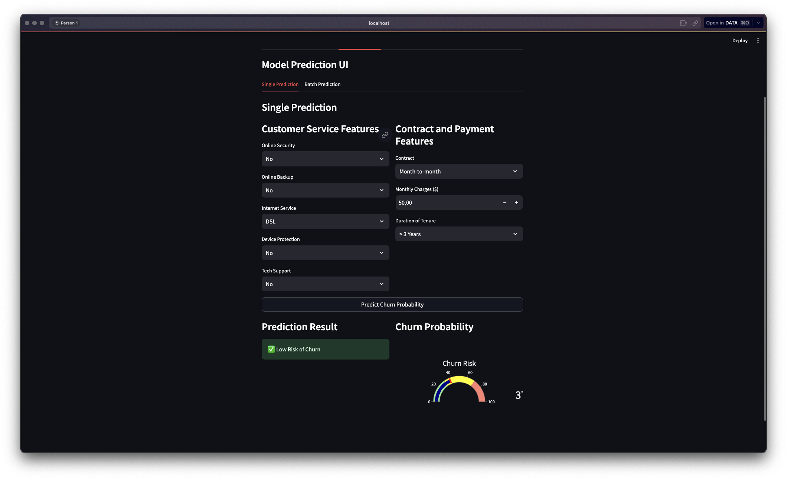
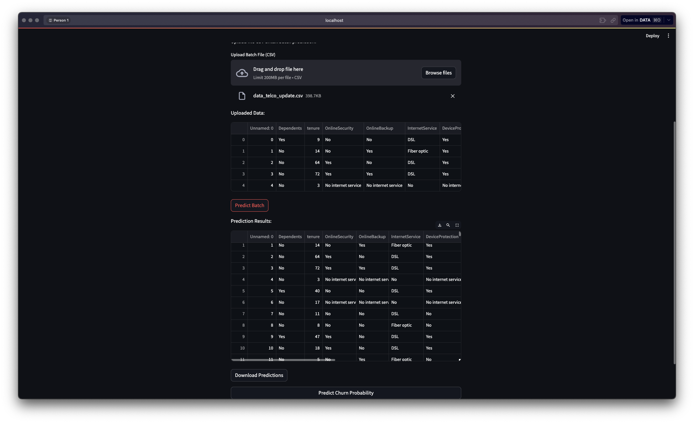

# CAPSTONE 3 PURWADHIKA

This is my Capstone Project of module 3 and module 4

this subject is about telco customer churn, where the telco company want detect customer retention\
we analyze from what the best feature here, how imbalancing the data, and hyper parameter tuning the data.\

## Result
From this data, we get 74% accuracy and 81 recall, where this is good to reduce false negative (type 2 error)

#### ROC-AUC and precision recall curve

#### Feature Importance

#### Shap value

--------------------------------------------
## GCP

--------------------------------------------
## Streamlit

- test

